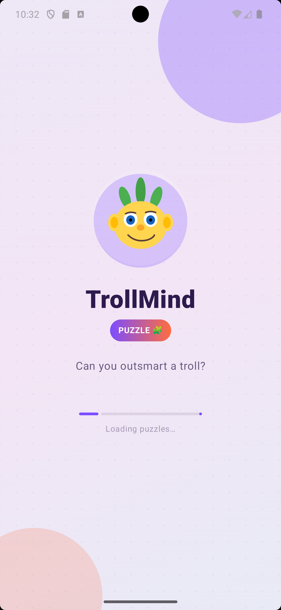
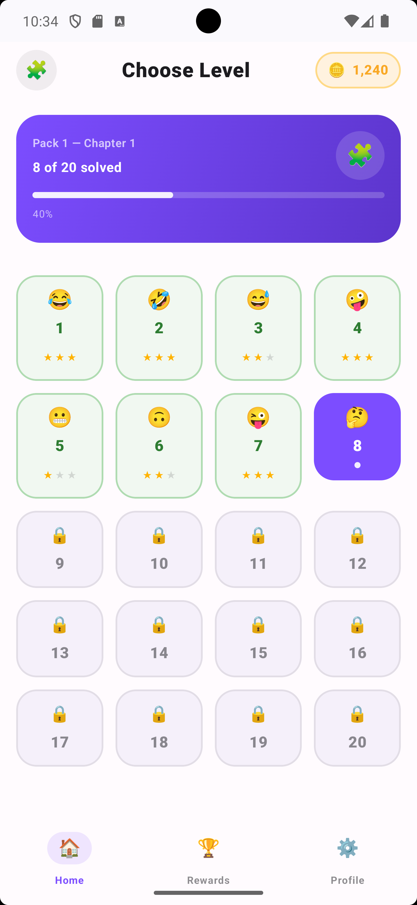
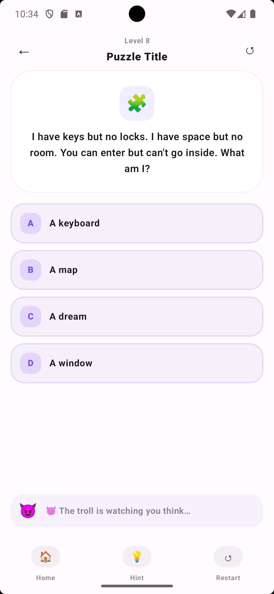

# 👹 TrollMind (TrapTap)

[English](README.en.md) | [فارسی](README.fa.md) | [Español](README.es.md) | [Português](README.pt.md) | [More...](../README.md)

---

## 📜 Deskripsi
**TrollMind** (juga dikenal sebagai **TrapTap**) adalah game teka-teki modern yang dirancang untuk menantang kecerdasanmu melawan troll yang nakal.
Dibangun secara native untuk Android menggunakan **Jetpack Compose** dan **Material 3**, aplikasi ini menawarkan UI yang dinamis dan interaktif dengan animasi yang halus.
Proyek ini mengikuti arsitektur **MVVM (Model-View-ViewModel)** dan menggunakan **Koin 4.0** untuk dependency injection yang kuat.

## ✨ Fitur
- 😈 **Akali si Troll:** Mekanik teka-teki interaktif dengan reaksi troll yang dinamis.
- 🎨 **Material 3 UI:** Desain modern dan responsif berdasarkan mockup Figma berkualitas tinggi.
- ⚡ **Animasi Lanjutan:** Maskot SVG kustom dengan animasi Float dan Pulse.
- 🌓 **Tema Dinamis:** Peralihan mulus antara mode Terang dan Gelap.
- 🌐 **Jangkauan Global:** Dukungan penuh untuk **25 bahasa** (termasuk Persia, Inggris, Mandarin, Rusia, Arab, dll.) dengan dukungan tata letak RTL otomatis.
- 📊 **Pelacakan Kemajuan:** Sistem perkembangan berbasis level dengan dasbor visual.
- 🏗️ **Arsitektur Bersih:** Dibangun dengan MVVM, StateFlow, dan Koin 4.0 untuk standar pengembangan premium.
- 💾 **Persistensi Kuat:** Memanfaatkan **Room Database** dan **DataStore** untuk penyimpanan data yang andal.

## 🛠 Dibangun Dengan

| Kategori | Teknologi |
| :--- | :--- |
| 🏛 Arsitektur | MVVM (Model-View-ViewModel) |
| 🖼️ UI Framework | [Jetpack Compose](https://developer.android.com/jetpack/compose) (Material 3) |
| 🛠️ Dependency Injection | [Koin 4.0](https://insert-koin.io/) |
| 🔄 Manajemen State | StateFlow & SharedFlow |
| 🧭 Navigasi | [Compose Navigation](https://developer.android.com/jetpack/compose/navigation) |
| 🔄 Coroutines | [Kotlinx Coroutines](https://github.com/Kotlin/kotlinx.coroutines) |
| 📦 Serialisasi | [Kotlinx Serialization](https://github.com/Kotlin/kotlinx.serialization) |
| 📦 Penyimpanan Lokal | [Room Database](https://developer.android.com/training/data-storage/room) & [DataStore](https://developer.android.com/topic/libraries/architecture/datastore) |
| 🧪 Pengujian | [JUnit 4](https://junit.org/junit4/), [MockK](https://mockk.io/), [Turbine](https://github.com/cashapp/turbine) |

## 🎮 Panduan Level
Lihat [Panduan Walkthrough Lengkap](../WALKTHROUGH.md) untuk solusi semua level.

## 📱 Tangkapan Layar
<table style="width:100%">
  <tr>
    <th align="center">Layar splash</th>
    <th align="center">Daftar level</th> 
    <th align="center">UI Game</th> 
  </tr>
  <tr>
    <td align="center"></td> 
    <td align="center"></td>
    <td align="center"></td>
  </tr>
</table>

---
**TrollMind** · Dikembangkan dengan ❤️ menggunakan Jetpack Compose.
